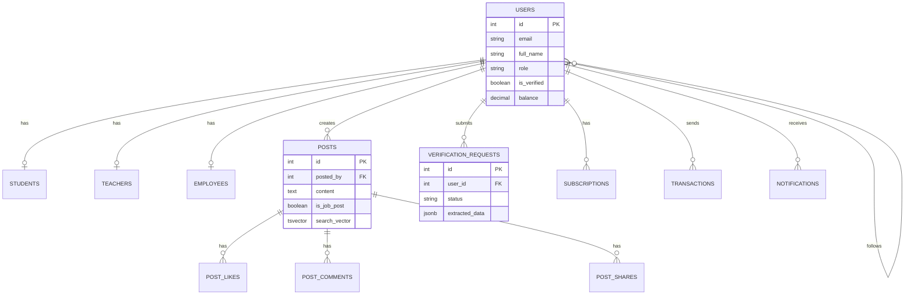
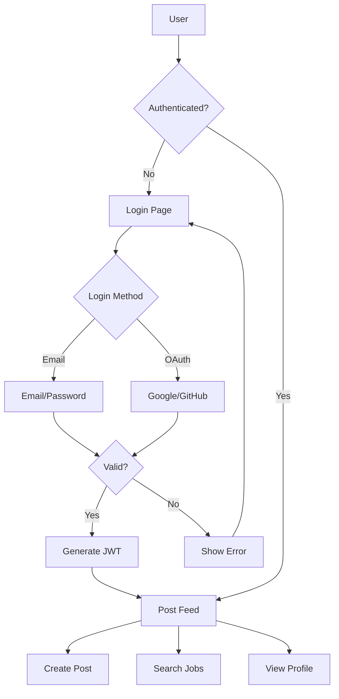

# Campus Gigs - Project Diagrams

This document contains the project flow diagrams and ER (Entity-Relationship) diagrams for the Campus Gigs platform. Copy the prompts below into any AI diagram generator (Claude, ChatGPT, Mermaid Live, draw.io, Lucidchart) to generate visual diagrams.

---

## 1. PROJECT FLOW DIAGRAM

### 1.1 System Architecture Flow

**Copy this prompt to generate the System Architecture Diagram:**

```
Create a system architecture diagram for a web application called "Campus Gigs" with the following components:

CLIENT TIER (Frontend):
- React.js + Vite (SPA)
- Material-UI Components
- Firebase SDK (Auth, Storage)
- Socket.io Client
- Axios HTTP Client

APPLICATION TIER (Backend):
- Node.js + Express.js (Port 5000)
- JWT Authentication Middleware
- RESTful API Routes
- Socket.io Server
- Multer (File Upload)
- Sharp (Image Processing)

DATA TIER:
- PostgreSQL 18 Database
- Firebase Storage (CDN)
- Firebase Authentication

EXTERNAL SERVICES:
- AWS Textract (ID Card OCR)
- Stripe (International Payments)
- SSLCommerz (Bangladesh Payments)

Show arrows indicating:
1. Frontend <-> Backend (HTTPS/REST API + WebSocket)
2. Backend <-> PostgreSQL (Connection Pool)
3. Backend <-> Firebase (Admin SDK)
4. Backend <-> AWS Textract (API)
5. Backend <-> Stripe/SSLCommerz (Webhooks)
6. Frontend <-> Firebase Auth (Direct)
7. Frontend <-> Firebase Storage (Direct Upload)

Use a three-tier architecture layout with colors:
- Frontend: Blue
- Backend: Green
- Database: Orange
- External Services: Purple
```

---

### 1.2 User Authentication Flow

**Copy this prompt to generate the Authentication Flow Diagram:**

```
Create a flowchart for user authentication in Campus Gigs platform:

START -> User visits Login Page

BRANCH 1 - Email/Password Login:
1. User enters email + password
2. Frontend sends POST /api/auth/signin
3. Backend validates credentials with Firebase Auth
4. Backend generates JWT token
5. Return token + user data to Frontend
6. Frontend stores token in localStorage
7. Redirect to Dashboard/Post Page

BRANCH 2 - Google OAuth Login:
1. User clicks "Sign in with Google"
2. Redirect to Google OAuth consent
3. Google returns auth code
4. Backend exchanges code for Firebase token
5. Backend creates/updates user in PostgreSQL
6. Generate JWT token
7. Redirect to Frontend with token

BRANCH 3 - New User Registration:
1. User fills signup form (name, email, password)
2. Frontend sends POST /api/auth/signup
3. Backend creates Firebase Auth user
4. Backend creates PostgreSQL user record
5. Backend sends verification email
6. User verifies email
7. Account activated -> Login

Include decision diamonds for:
- Is email verified?
- Does user exist?
- Is password correct?
- Is OAuth successful?

End states:
- SUCCESS: User logged in, redirect to /post
- FAILURE: Show error message, stay on login
```

---

### 1.3 ID Verification Flow

**Copy this prompt to generate the ID Verification Flow Diagram:**

```
Create a detailed flowchart for ID Card Verification process:

USER SIDE:
1. User navigates to /verification page
2. User selects role (Student/Teacher/Employee)
3. User uploads ID card image (JPEG/PNG, max 10MB)
4. Frontend validates file type and size
5. Frontend sends POST /api/verification/submit with FormData
6. User sees "Processing..." status
7. User receives notification when reviewed

BACKEND PROCESSING:
1. Multer middleware receives file
2. Sharp.js compresses image (60-70% size reduction)
3. Upload compressed image to Firebase Storage
4. Get Firebase download URL
5. Send image to AWS Textract AnalyzeID API
6. Textract extracts fields: Name, ID Number, DOB, Institution
7. Calculate confidence score
8. Store in verification_requests table:
   - user_id
   - role
   - id_card_url
   - extracted_data (JSONB)
   - status = 'pending'
9. Return success to user

ADMIN REVIEW:
1. Admin views /admin dashboard
2. Admin sees pending verifications queue
3. Admin clicks on verification request
4. Admin views: Original image + Extracted data
5. Decision: APPROVE or REJECT

IF APPROVED:
1. Update verification_requests.status = 'approved'
2. Database trigger fires
3. Update users.is_verified = true
4. Update users.role = selected role
5. Log admin action in admin_logs
6. Send notification to user

IF REJECTED:
1. Update verification_requests.status = 'rejected'
2. Add admin_notes (reason for rejection)
3. Log admin action
4. Send notification with rejection reason

Show swimlanes for: User, Frontend, Backend, AWS Textract, Admin
```

---

### 1.4 Payment Flow (Dual Gateway)

**Copy this prompt to generate the Payment Flow Diagram:**

```
Create a payment flow diagram showing dual gateway integration:

PAYMENT INITIATION:
1. User selects subscription plan (15 days / 30 days / Yearly)
2. User chooses payment method:
   - Option A: International (Stripe) - Card payments
   - Option B: Local (SSLCommerz) - bKash, Nagad, Rocket, Card

STRIPE FLOW (International):
1. Frontend creates PaymentIntent via /api/stripe/create-intent
2. Backend creates Stripe PaymentIntent with amount
3. Return client_secret to Frontend
4. Frontend shows Stripe Elements card form
5. User enters card details
6. Stripe processes payment
7. Stripe sends webhook to /api/stripe/webhook
8. Backend verifies webhook signature
9. Update payment_transactions table
10. Activate subscription
11. Redirect to /payment/success

SSLCOMMERZ FLOW (Bangladesh):
1. Frontend calls /api/sslcommerz/subscription/initiate
2. Backend builds SSLCommerz payment data
3. SSLCommerz returns GatewayPageURL
4. Redirect user to SSLCommerz payment page
5. User selects bKash/Nagad/Card
6. User completes payment
7. SSLCommerz redirects to success_url/fail_url
8. Backend receives IPN webhook
9. Verify transaction with SSLCommerz validation API
10. Update payment_transactions table
11. Activate subscription
12. Show success/failure page

DATABASE UPDATES:
- subscriptions table: Create new subscription record
- payment_transactions table: Log payment details
- users table: Update premium status

Error Handling:
- Payment failed -> Redirect to /payment/failed
- Payment cancelled -> Redirect to /payment/cancelled
- Webhook verification failed -> Log error, don't update

Use colors: Stripe=Purple, SSLCommerz=Green, Database=Orange
```

---

### 1.5 Job Search Flow

**Copy this prompt to generate the Job Search Flow Diagram:**

```
Create a flowchart for PostgreSQL Full-Text Search functionality:

USER INTERACTION:
1. User types in search bar on /post page
2. Debounce input (300ms delay)
3. If query length >= 2 characters, trigger search

AUTOCOMPLETE:
1. Frontend calls GET /api/search/suggestions?q={query}
2. Backend queries popular_tags materialized view
3. Return matching suggestions
4. Display dropdown with suggestions

FULL SEARCH:
1. User submits search or selects suggestion
2. Frontend calls GET /api/search/posts with params:
   - q (search query)
   - category (optional filter)
   - job_type (Full-time, Part-time, Internship)
   - location (optional filter)
   - tags (array of tags)
   - page, limit (pagination)

BACKEND PROCESSING:
1. Parse search query
2. Convert to tsquery format
3. Execute search_posts() PostgreSQL function
4. Function searches weighted columns:
   - A: title (highest weight)
   - B: job_title
   - C: description
   - D: tags
5. Apply filters (category, location, job_type)
6. Calculate ts_rank for relevance scoring
7. Return sorted results with pagination

RESULTS DISPLAY:
1. Frontend receives job posts array
2. Display results in card format
3. Show: Title, Category, Location, Salary Range, Tags
4. Active filters shown as chips
5. User can remove filters to broaden search

ADDITIONAL ENDPOINTS:
- GET /api/search/categories -> Popular job categories
- GET /api/search/tags -> Popular tags
- GET /api/search/filters -> Available filter options

Show the data flow from UI -> API -> PostgreSQL -> Response
```

---

### 1.6 Real-Time Notification Flow

**Copy this prompt to generate the Notification Flow Diagram:**

```
Create a real-time notification system diagram:

SOCKET.IO CONNECTION:
1. User logs in successfully
2. Frontend establishes Socket.io connection to backend
3. User joins personal room: room_user_{userId}
4. Connection status tracked in active_users

NOTIFICATION TRIGGERS:
1. Someone likes your post
2. Someone comments on your post
3. Someone reposts your content
4. Someone follows you
5. Verification status updated
6. Payment completed
7. New message received

NOTIFICATION FLOW:
1. Action occurs (e.g., User A likes User B's post)
2. Backend creates notification record:
   - user_id (recipient)
   - actor_id (who performed action)
   - type (like, comment, follow, etc.)
   - reference_id (post_id, etc.)
   - message
   - is_read = false
3. Backend emits Socket.io event to recipient's room
4. Frontend receives event
5. Update notification bell badge (+1)
6. Show toast notification
7. Add to notification dropdown list

NOTIFICATION MANAGEMENT:
- GET /api/notifications - List all notifications
- GET /api/notifications/unread-count - Badge count
- PUT /api/notifications/:id/read - Mark as read
- PUT /api/notifications/mark-all-read - Mark all read
- DELETE /api/notifications/:id - Delete notification

Show: Event emitter -> Socket.io Server -> Client rooms -> UI updates
```

---

## 2. ER DIAGRAM (Entity-Relationship)

### 2.1 Complete Database ER Diagram

**Copy this prompt to generate the Complete ER Diagram:**

```
Create an Entity-Relationship Diagram for Campus Gigs database with these tables:

=== CORE TABLES ===

USERS (Primary entity)
- id: SERIAL PRIMARY KEY
- firebase_uid: VARCHAR(255) UNIQUE
- full_name: VARCHAR(255) NOT NULL
- username: VARCHAR(255) UNIQUE
- email: VARCHAR(255) UNIQUE NOT NULL
- password: VARCHAR(255)
- phone: VARCHAR(50)
- profile_picture: TEXT
- profession: VARCHAR(50)
- provider: VARCHAR(50) DEFAULT 'local'
- provider_id: VARCHAR(255)
- role: VARCHAR(20) DEFAULT 'user'
- is_verified: BOOLEAN DEFAULT false
- verified_at: TIMESTAMP
- verified_by: INTEGER (FK -> users.id)
- balance: DECIMAL(10,2) DEFAULT 0.00
- is_premium: BOOLEAN DEFAULT false
- premium_until: TIMESTAMP
- terms_agreed: BOOLEAN DEFAULT true
- created_at: TIMESTAMP
- updated_at: TIMESTAMP

STUDENTS (1:1 with users)
- id: SERIAL PRIMARY KEY
- user_id: INTEGER NOT NULL (FK -> users.id)
- full_name: TEXT NOT NULL
- username: VARCHAR(255) UNIQUE NOT NULL
- phone: VARCHAR(50)
- profile_pic_url: TEXT
- cover_pic_url: TEXT
- profession: VARCHAR DEFAULT 'Student'
- gender: ENUM('Male','Female','Other','Prefer not to say')
- bio: TEXT
- location: TEXT
- website_url: TEXT
- interests: TEXT[]
- education: JSONB
- professional_skills: TEXT[]
- certificates: JSONB
- followers_count: INTEGER DEFAULT 0
- following_count: INTEGER DEFAULT 0
- created_at: TIMESTAMP
- updated_at: TIMESTAMP

TEACHERS (1:1 with users)
- id: SERIAL PRIMARY KEY
- user_id: INTEGER NOT NULL (FK -> users.id)
- full_name: TEXT NOT NULL
- username: VARCHAR(255) UNIQUE NOT NULL
- phone: VARCHAR(50)
- profile_pic_url: TEXT
- cover_pic_url: TEXT
- profession: VARCHAR DEFAULT 'Teacher'
- gender: ENUM
- bio: TEXT
- location: TEXT
- website_url: TEXT
- interests: TEXT[]
- education: JSONB
- professional_skills: TEXT[]
- certificates: JSONB
- followers_count: INTEGER DEFAULT 0
- following_count: INTEGER DEFAULT 0
- created_at: TIMESTAMP
- updated_at: TIMESTAMP

EMPLOYEES (1:1 with users)
- id: SERIAL PRIMARY KEY
- user_id: INTEGER NOT NULL (FK -> users.id)
- full_name: TEXT NOT NULL
- username: VARCHAR(255) UNIQUE NOT NULL
- phone: VARCHAR(50)
- profile_pic_url: TEXT
- cover_pic_url: TEXT
- profession: VARCHAR DEFAULT 'Employee'
- company: VARCHAR(255)
- position: VARCHAR(255)
- experience: INTEGER
- bio: TEXT
- location: TEXT
- interests: TEXT[]
- professional_skills: TEXT[]
- certificates: JSONB
- followers_count: INTEGER DEFAULT 0
- following_count: INTEGER DEFAULT 0
- created_at: TIMESTAMP
- updated_at: TIMESTAMP

=== CONTENT TABLES ===

POSTS
- id: SERIAL PRIMARY KEY
- posted_by: INTEGER NOT NULL (FK -> users.id)
- content: TEXT NOT NULL
- media: TEXT[] (array of URLs)
- likes_count: INTEGER DEFAULT 0
- shares_count: INTEGER DEFAULT 0
- comments_count: INTEGER DEFAULT 0
- is_repost: BOOLEAN DEFAULT false
- repost_of: INTEGER (FK -> posts.id)
- repost_comment: TEXT
- is_job_post: BOOLEAN DEFAULT false
- job_title: VARCHAR(255)
- job_category: VARCHAR(100)
- job_type: VARCHAR(50)
- job_location: VARCHAR(255)
- job_salary_range: VARCHAR(100)
- tags: TEXT[]
- search_vector: TSVECTOR
- created_at: TIMESTAMP
- updated_at: TIMESTAMP

POST_LIKES
- id: SERIAL PRIMARY KEY
- post_id: INTEGER NOT NULL (FK -> posts.id)
- user_id: INTEGER NOT NULL (FK -> users.id)
- created_at: TIMESTAMP
- UNIQUE(post_id, user_id)

POST_SHARES
- id: SERIAL PRIMARY KEY
- post_id: INTEGER NOT NULL (FK -> posts.id)
- user_id: INTEGER NOT NULL (FK -> users.id)
- created_at: TIMESTAMP
- UNIQUE(post_id, user_id)

POST_COMMENTS
- id: SERIAL PRIMARY KEY
- post_id: INTEGER NOT NULL (FK -> posts.id)
- user_id: INTEGER NOT NULL (FK -> users.id)
- content: TEXT NOT NULL
- parent_id: INTEGER (FK -> post_comments.id for replies)
- created_at: TIMESTAMP
- updated_at: TIMESTAMP

=== SOCIAL TABLES ===

FOLLOWERS
- id: SERIAL PRIMARY KEY
- follower_id: INTEGER NOT NULL (FK -> users.id)
- following_id: INTEGER NOT NULL (FK -> users.id)
- created_at: TIMESTAMP
- UNIQUE(follower_id, following_id)

NOTIFICATIONS
- id: SERIAL PRIMARY KEY
- user_id: INTEGER NOT NULL (FK -> users.id)
- actor_id: INTEGER (FK -> users.id)
- type: VARCHAR(50) NOT NULL
- reference_id: INTEGER
- message: TEXT
- is_read: BOOLEAN DEFAULT false
- created_at: TIMESTAMP

=== VERIFICATION TABLES ===

VERIFICATION_REQUESTS
- id: SERIAL PRIMARY KEY
- user_id: INTEGER NOT NULL (FK -> users.id)
- role: VARCHAR(20) NOT NULL
- id_card_url: TEXT NOT NULL
- extracted_data: JSONB
- status: VARCHAR(20) DEFAULT 'pending'
- admin_notes: TEXT
- reviewed_by: INTEGER (FK -> users.id)
- reviewed_at: TIMESTAMP
- created_at: TIMESTAMP
- updated_at: TIMESTAMP

ADMIN_LOGS
- id: SERIAL PRIMARY KEY
- admin_id: INTEGER NOT NULL (FK -> users.id)
- action: VARCHAR(100) NOT NULL
- target_type: VARCHAR(50)
- target_id: INTEGER
- details: JSONB
- ip_address: INET
- created_at: TIMESTAMP

=== PAYMENT TABLES ===

SUBSCRIPTIONS
- id: SERIAL PRIMARY KEY
- user_id: INTEGER NOT NULL (FK -> users.id)
- plan_type: VARCHAR(20) NOT NULL
- status: VARCHAR(20) DEFAULT 'pending'
- start_date: TIMESTAMP NOT NULL
- end_date: TIMESTAMP NOT NULL
- auto_renew: BOOLEAN DEFAULT true
- created_at: TIMESTAMP
- updated_at: TIMESTAMP

PAYMENT_TRANSACTIONS
- id: SERIAL PRIMARY KEY
- user_id: INTEGER NOT NULL (FK -> users.id)
- subscription_id: INTEGER (FK -> subscriptions.id)
- transaction_id: VARCHAR(255) UNIQUE NOT NULL
- amount: DECIMAL(10,2) NOT NULL
- currency: VARCHAR(3) DEFAULT 'BDT'
- payment_method: VARCHAR(50)
- gateway: VARCHAR(20)
- status: VARCHAR(20) DEFAULT 'pending'
- gateway_response: JSONB
- ssl_val_id: VARCHAR(255)
- ssl_card_type: VARCHAR(50)
- ssl_bank_tran_id: VARCHAR(255)
- created_at: TIMESTAMP
- updated_at: TIMESTAMP

USER_TRANSACTIONS (P2P transfers)
- id: SERIAL PRIMARY KEY
- sender_id: INTEGER NOT NULL (FK -> users.id)
- receiver_id: INTEGER NOT NULL (FK -> users.id)
- amount: DECIMAL(10,2) NOT NULL
- transaction_type: VARCHAR(50) DEFAULT 'transfer'
- payment_method: VARCHAR(50)
- status: VARCHAR(20) DEFAULT 'completed'
- notes: TEXT
- payment_reference: TEXT
- created_at: TIMESTAMP
- updated_at: TIMESTAMP

=== RELATIONSHIPS ===

1:1 Relationships:
- users -> students (user_id)
- users -> teachers (user_id)
- users -> employees (user_id)

1:N Relationships:
- users -> posts (posted_by)
- users -> verification_requests (user_id)
- users -> subscriptions (user_id)
- users -> payment_transactions (user_id)
- users -> notifications (user_id)
- posts -> post_likes (post_id)
- posts -> post_shares (post_id)
- posts -> post_comments (post_id)
- posts -> posts (repost_of, self-referencing)
- post_comments -> post_comments (parent_id, self-referencing)

N:N Relationships (via junction tables):
- users <-> users via followers (follower_id, following_id)
- users <-> posts via post_likes
- users <-> posts via post_shares

Use crow's foot notation for cardinality.
Color code: Core=Blue, Content=Green, Social=Yellow, Verification=Orange, Payment=Purple
```

---

### 2.2 Simplified ER Diagram

**Copy this prompt for a simpler ER Diagram:**

```
Create a simplified ER diagram showing main entities and relationships:

ENTITIES:
1. USERS (id, email, full_name, role, is_verified, balance)
2. STUDENTS (id, user_id, username, bio, skills)
3. TEACHERS (id, user_id, username, bio, skills)
4. EMPLOYEES (id, user_id, username, company, position)
5. POSTS (id, user_id, content, media, likes_count, is_job_post)
6. FOLLOWERS (follower_id, following_id)
7. VERIFICATION_REQUESTS (id, user_id, status, extracted_data)
8. SUBSCRIPTIONS (id, user_id, plan_type, status)
9. TRANSACTIONS (id, sender_id, receiver_id, amount)
10. NOTIFICATIONS (id, user_id, type, message)

RELATIONSHIPS:
- User HAS ONE Student/Teacher/Employee profile
- User CREATES many Posts
- User FOLLOWS many Users (self-referencing N:N)
- User SUBMITS many Verification Requests
- User HAS many Subscriptions
- User SENDS/RECEIVES many Transactions
- User RECEIVES many Notifications
- Post HAS many Likes, Comments, Shares

Show with simple boxes and connecting lines.
```

---

## 3. DATA FLOW DIAGRAM (DFD)

### 3.1 Level 0 DFD (Context Diagram)

**Copy this prompt to generate Context Diagram:**

```
Create a Level 0 Data Flow Diagram (Context Diagram) for Campus Gigs:

EXTERNAL ENTITIES:
1. User (Student/Teacher/Employee)
2. Admin
3. Firebase (Auth + Storage)
4. AWS Textract
5. Stripe
6. SSLCommerz

CENTRAL PROCESS:
- Campus Gigs Platform (0)

DATA FLOWS:

User -> Platform:
- Registration data
- Login credentials
- Profile information
- Post content + media
- Search queries
- Payment requests
- ID card image

Platform -> User:
- Authentication token
- Profile data
- Post feed
- Search results
- Payment confirmation
- Verification status
- Notifications

Admin -> Platform:
- Login credentials
- Verification decisions
- User management actions

Platform -> Admin:
- Pending verifications
- Statistics dashboard
- Admin logs

Platform <-> Firebase:
- Auth tokens
- User verification
- File uploads/downloads

Platform <-> AWS Textract:
- ID card image
- Extracted text data

Platform <-> Stripe:
- Payment intent
- Webhook events

Platform <-> SSLCommerz:
- Payment initiation
- Transaction validation

Use standard DFD symbols: rectangles for entities, circle for process, arrows for data flow
```

---

### 3.2 Level 1 DFD

**Copy this prompt to generate Level 1 DFD:**

```
Create a Level 1 Data Flow Diagram decomposing the Campus Gigs system:

PROCESSES:
1.0 Authentication System
2.0 Profile Management
3.0 Content Management (Posts)
4.0 Search System
5.0 Verification System
6.0 Payment System
7.0 Notification System

DATA STORES:
D1: Users Database
D2: Posts Database
D3: Verification Requests
D4: Transactions
D5: Notifications

DATA FLOWS:

1.0 Authentication:
- Input: credentials from User
- Output: JWT token to User
- Reads/Writes: D1 Users

2.0 Profile Management:
- Input: profile data from User
- Output: profile info to User
- Reads/Writes: D1 Users

3.0 Content Management:
- Input: post content from User
- Output: post feed to User
- Reads/Writes: D2 Posts, D1 Users

4.0 Search System:
- Input: search query from User
- Output: search results to User
- Reads: D2 Posts

5.0 Verification System:
- Input: ID card from User, decision from Admin
- Output: status to User, queue to Admin
- Uses: AWS Textract external
- Reads/Writes: D3 Verification, D1 Users

6.0 Payment System:
- Input: payment request from User
- Output: confirmation to User
- Uses: Stripe, SSLCommerz external
- Reads/Writes: D4 Transactions, D1 Users

7.0 Notification System:
- Input: events from other processes
- Output: alerts to User
- Reads/Writes: D5 Notifications

Show process bubbles, data stores as open rectangles, external entities as boxes
```

---

## 4. USE CASE DIAGRAM

**Copy this prompt to generate Use Case Diagram:**

```
Create a Use Case Diagram for Campus Gigs platform:

ACTORS:
1. Guest (unauthenticated user)
2. User (authenticated - Student/Teacher/Employee)
3. Admin (system administrator)
4. System (automated processes)

USE CASES FOR GUEST:
- View public posts
- Register account
- Login (email/password)
- Login with Google
- Login with GitHub
- Reset password

USE CASES FOR USER:
- Create profile (Student/Teacher/Employee)
- Update profile
- Create post
- Like post
- Comment on post
- Share/Repost post
- Search posts/jobs
- Follow/Unfollow users
- View notifications
- Submit ID for verification
- Subscribe to premium
- Make payment (Stripe/SSLCommerz)
- Send money to users
- View transaction history
- Update payment preferences
- Logout
- Delete account

USE CASES FOR ADMIN:
- Login to admin panel
- View verification queue
- Approve verification
- Reject verification
- View statistics
- View admin logs
- Manage users

USE CASES FOR SYSTEM:
- Send notification
- Process payment webhook
- Update search index
- Refresh materialized views
- Auto-expire subscriptions

RELATIONSHIPS:
- Guest extends to User after login
- User extends to Admin for admin actions
- <<include>> relationships for payment: Subscribe includes Make Payment
- <<extend>> relationships: Create Post extends to Upload Media

Draw with stick figures for actors, ovals for use cases, system boundary rectangle
```

---

## 5. CLASS DIAGRAM

**Copy this prompt to generate Class Diagram:**

```
Create a Class Diagram for Campus Gigs backend models:

CLASSES:

User
- id: int
- email: string
- fullName: string
- password: string
- role: string
- isVerified: boolean
- balance: decimal
+ create(data): User
+ findOne(email): User
+ findById(id): User
+ update(id, data): User
+ delete(id): boolean
+ followUser(followerId, followingId): void
+ unfollowUser(followerId, followingId): void
+ getFollowers(userId): User[]
+ getFollowing(userId): User[]

Student (extends Profile)
- userId: int
- username: string
- bio: string
- education: JSON
- skills: string[]
- certificates: JSON
+ createOrUpdate(userId, data): Student
+ findByUsername(username): Student

Teacher (extends Profile)
- userId: int
- username: string
- bio: string
- education: JSON
- skills: string[]
+ createOrUpdate(userId, data): Teacher
+ findByUsername(username): Teacher

Employee (extends Profile)
- userId: int
- username: string
- company: string
- position: string
- experience: int
+ createOrUpdate(userId, data): Employee
+ findByUsername(username): Employee

Post
- id: int
- postedBy: int
- content: string
- media: string[]
- likesCount: int
- sharesCount: int
- isJobPost: boolean
- searchVector: tsvector
+ create(userId, content, media): Post
+ getAll(userId, limit, offset): Post[]
+ getById(id): Post
+ update(id, data): Post
+ delete(id): boolean
+ like(postId, userId): void
+ unlike(postId, userId): void
+ share(postId, userId): void

VerificationRequest
- id: int
- userId: int
- role: string
- idCardUrl: string
- extractedData: JSON
- status: string
+ submit(userId, role, file): VerificationRequest
+ approve(id, adminId): void
+ reject(id, adminId, notes): void
+ getPending(): VerificationRequest[]

Transaction
- id: int
- senderId: int
- receiverId: int
- amount: decimal
- status: string
+ create(senderId, receiverId, amount): Transaction
+ getUserTransactions(userId): Transaction[]
+ getBalance(userId): decimal

Subscription
- id: int
- userId: int
- planType: string
- status: string
- startDate: date
- endDate: date
+ create(userId, plan): Subscription
+ activate(id): void
+ expire(id): void
+ getUserSubscription(userId): Subscription

RELATIONSHIPS:
- User "1" -- "0..1" Student
- User "1" -- "0..1" Teacher
- User "1" -- "0..1" Employee
- User "1" -- "*" Post
- User "1" -- "*" VerificationRequest
- User "1" -- "*" Subscription
- User "1" -- "*" Transaction (as sender)
- User "1" -- "*" Transaction (as receiver)
- User "*" -- "*" User (followers)

Use UML class notation with +public, -private, visibility markers
```

---

## 6. SEQUENCE DIAGRAMS

### 6.1 User Registration Sequence

**Copy this prompt:**

```
Create a sequence diagram for user registration:

Participants: User, Frontend, Backend, Firebase Auth, PostgreSQL

1. User fills registration form
2. User clicks "Sign Up"
3. Frontend validates input
4. Frontend -> Backend: POST /api/auth/signup {email, password, fullName}
5. Backend -> Firebase Auth: createUser(email, password)
6. Firebase Auth -> Backend: {uid, email}
7. Backend -> PostgreSQL: INSERT INTO users (firebase_uid, email, full_name)
8. PostgreSQL -> Backend: {id, email, fullName}
9. Backend generates JWT token
10. Backend -> Frontend: {token, user}
11. Frontend stores token in localStorage
12. Frontend -> User: Redirect to profile setup

Alt: If email exists
- Firebase Auth -> Backend: Error "email already exists"
- Backend -> Frontend: {error: "Email already registered"}
- Frontend -> User: Show error message

Show lifelines, activation boxes, and arrows with messages
```

### 6.2 ID Verification Sequence

**Copy this prompt:**

```
Create a sequence diagram for ID verification:

Participants: User, Frontend, Backend, Firebase Storage, AWS Textract, PostgreSQL, Admin

1. User selects role and uploads ID card
2. Frontend -> Backend: POST /api/verification/submit (FormData)
3. Backend compresses image with Sharp
4. Backend -> Firebase Storage: upload(compressedImage)
5. Firebase Storage -> Backend: {downloadUrl}
6. Backend -> AWS Textract: AnalyzeID(imageUrl)
7. AWS Textract -> Backend: {extractedFields, confidence}
8. Backend -> PostgreSQL: INSERT verification_requests
9. Backend -> Frontend: {status: "pending"}
10. Frontend -> User: "Verification submitted"

--- Later: Admin Review ---

11. Admin opens admin dashboard
12. Frontend -> Backend: GET /api/verification/admin/pending
13. Backend -> PostgreSQL: SELECT * FROM verification_requests WHERE status='pending'
14. Backend -> Frontend: {pendingList}
15. Admin reviews and approves
16. Frontend -> Backend: POST /api/verification/admin/approve/:id
17. Backend -> PostgreSQL: UPDATE verification_requests SET status='approved'
18. PostgreSQL Trigger: UPDATE users SET is_verified=true
19. Backend -> PostgreSQL: INSERT admin_logs
20. Backend -> User (via Socket.io): notification "Verification approved"
21. Backend -> Frontend: {success: true}

Show with two separate interaction frames: User submission and Admin review
```

---

## 7. COMPONENT DIAGRAM

**Copy this prompt to generate Component Diagram:**

```
Create a component diagram showing Campus Gigs system components:

FRONTEND COMPONENTS:
[React App]
  ├── [Auth Module]
  │   ├── Login
  │   ├── Signup
  │   └── OAuth Handlers
  ├── [Profile Module]
  │   ├── StudentProfile
  │   ├── TeacherProfile
  │   └── EmployeeProfile
  ├── [Post Module]
  │   ├── PostFeed
  │   ├── PostCreator
  │   ├── JobSearchBar
  │   └── PostInteractions
  ├── [Payment Module]
  │   ├── Premium Subscription
  │   ├── SendMoney
  │   └── PaymentCallback
  ├── [Admin Module]
  │   ├── AdminDashboard
  │   ├── VerificationQueue
  │   └── VerificationStats
  └── [Shared]
      ├── Notifications
      ├── ProtectedRoute
      └── API Service

BACKEND COMPONENTS:
[Express Server]
  ├── [Routes]
  │   ├── authRoutes
  │   ├── postRoutes
  │   ├── verificationRoutes
  │   ├── searchRoutes
  │   ├── paymentRoutes
  │   └── notificationRoutes
  ├── [Controllers]
  │   ├── authController
  │   ├── postController
  │   ├── verificationController
  │   ├── searchController
  │   └── paymentController
  ├── [Services]
  │   ├── textractService (AWS)
  │   ├── stripeService
  │   └── sslcommerzService
  ├── [Middleware]
  │   ├── authMiddleware
  │   └── uploadMiddleware
  └── [Models]
      ├── User
      ├── Post
      ├── Transaction
      └── VerificationRequest

EXTERNAL COMPONENTS:
[Firebase] - Auth, Storage
[PostgreSQL] - Database
[AWS Textract] - OCR Service
[Stripe] - International Payments
[SSLCommerz] - Local Payments
[Socket.io] - Real-time Communication

Show interfaces between components with required/provided notation
```

---

## 8. DEPLOYMENT DIAGRAM

**Copy this prompt to generate Deployment Diagram:**

```
Create a deployment diagram for Campus Gigs:

NODES:

<<device>> User's Browser
  - React SPA
  - Firebase SDK

<<execution environment>> Vercel/Netlify
  - Static Files
  - CDN Distribution

<<execution environment>> Heroku/Railway
  - Node.js Runtime
  - Express.js Server
  - Socket.io Server

<<database server>> Heroku Postgres / AWS RDS
  - PostgreSQL 18
  - Connection Pool (max: 20)

<<cloud service>> Firebase
  - Authentication Service
  - Cloud Storage (5GB)
  - CDN

<<cloud service>> AWS
  - Textract Service
  - Region: ap-south-1

<<cloud service>> Stripe
  - Payment Processing
  - Webhook Endpoint

<<cloud service>> SSLCommerz
  - Payment Gateway
  - IPN Endpoint

COMMUNICATION PATHS:
- Browser <-> Vercel: HTTPS (port 443)
- Browser <-> Heroku: HTTPS + WSS (port 443)
- Heroku <-> PostgreSQL: TCP (port 5432, SSL)
- Heroku <-> Firebase: HTTPS (Admin SDK)
- Browser <-> Firebase: HTTPS (Client SDK)
- Heroku <-> AWS Textract: HTTPS (API)
- Heroku <-> Stripe: HTTPS (Webhooks)
- Heroku <-> SSLCommerz: HTTPS (API + IPN)

Show nodes as 3D boxes, artifacts inside, and communication links with protocols
```

---

## QUICK REFERENCE - AI Tools for Diagrams

| Tool | Best For | How to Use |
|------|----------|------------|
| **Mermaid Live** | Flowcharts, ER diagrams | Paste Mermaid code |
| **draw.io** | All diagram types | Use prompts as reference |
| **Lucidchart** | Professional diagrams | Use AI assistant |
| **PlantUML** | UML diagrams | Use PlantUML syntax |
| **Eraser.io** | Quick diagrams | Paste prompts directly |
| **ChatGPT/Claude** | Generate Mermaid code | Ask to convert prompts |
| **Excalidraw** | Hand-drawn style | Manual drawing |

---

## Mermaid Code Examples

### Quick ER Diagram (Mermaid)



### Quick Flowchart (Mermaid)



---

**Last Updated:** December 2025  
**Project:** Campus Gigs - Social Networking & Job Marketplace Platform
